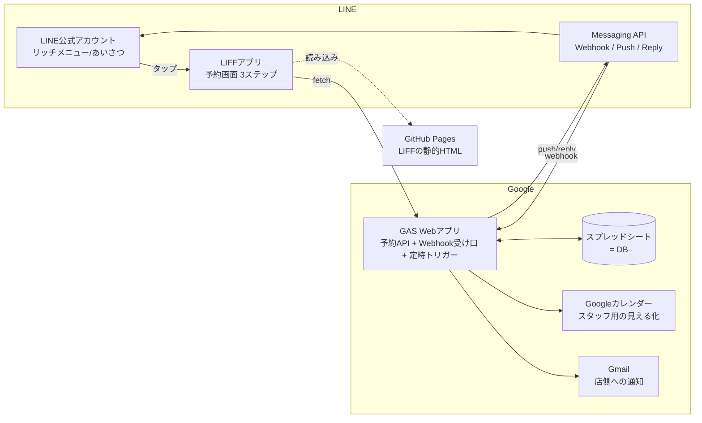

# LINE予約システム 自作設計図（STORES 予約 × LINE の代替）

作成：2026-09-07
目的：STORES 予約＋LINEミニアプリ連携（**月額 14,190円〜**）を払わず、**LINE公式アカウント＋Google（GAS・スプレッドシート）＋LIFF で同等の予約体験を自前で構築する**。
前提資料：`_drafts/STORES予約×LINE_構築手順.md`（STORES版の手順・料金・機能一覧）

> **結論：月額0円で作れる。** 追加費用が出るのは「LINEの配信通数が月200通を超えたとき」だけ（ライトプラン 5,000円）。それでもSTORESの1/3以下。
> 再現できないのは **事前決済・POSレジ連携・月謝/回数券** の3つ。これが要件に入るなら自作は止めてSTORESにする。

---

## 0. 与件（この設計が前提にしていること）

| 項目 | 前提 | 変わると影響する箇所 |
|---|---|---|
| 店舗 | 1店舗 | 複数店なら「店舗」テーブル追加＋LIFFに店舗選択ステップ |
| 予約の形 | メニュー → 担当スタッフ（任意）→ 日時 → 氏名・電話 の**3ステップ**（STORESと同じ） | レッスン・イベント型（定員あり）なら「枠」テーブルの持ち方が変わる |
| 枠 | 30分刻み・営業時間内・メニューの所要時間ぶん連続で空いていれば予約可 | — |
| 決済 | **現地決済のみ**（事前決済なし） | 事前決済が要るなら Square/Stripe の決済リンクを確認画面に貼る（別途手数料3.6%前後） |
| 通知 | 予約完了（即時）・前日リマインド・変更/キャンセル | — |
| 管理側 | スプレッドシートとGoogleカレンダーで見る（専用アプリは作らない） | — |
| 客数 | 月200件以下の予約 | 超えるならLINE公式のライトプラン（5,000円/月・5,000通） |

---

## 1. 全体構成



**役割分担（4つだけ）**

| 部品 | 何をするか | 費用 |
|---|---|---|
| LINE公式アカウント | 入口（リッチメニュー・あいさつ）と通知の配送 | 0円（コミュニケーションプラン・月200通） |
| LIFF（静的HTML 1枚） | 予約画面。LINEを閉じずに動く | 0円（GitHub Pages に置く） |
| GAS Webアプリ | 空き枠計算・予約登録・通知送信・リマインド | 0円 |
| スプレッドシート | 予約・顧客・メニュー・スタッフのDB | 0円 |

**なぜこの組み合わせか（他案を捨てた理由）**
- 無料の外部予約ツール（RESERVA等）へのリンク：LINEを閉じて外に飛ぶ＋通知がLINEに来ない＝STORESの売り（P4）が全部消える。
- 全部GASの `HtmlService` でLIFFまで出す：作れるが、GASの画面は iframe 経由で LIFF のログイン戻りが不安定。**画面は GitHub Pages、APIは GAS** に分けるのが安定。
- LINEミニアプリ（審査あり）ではなく **LIFF（審査なし）** で作る。見た目・挙動はほぼ同じ。審査待ち2週間〜2ヶ月が消える。

---

## 2. STORES の機能をどう再現するか

パンフ P4〜P6・P13〜P17 の機能との対応。**◎＝同等／○＝簡易版／✕＝作らない**。

| STORESの機能 | 自作 | どう作るか |
|---|---|---|
| LINEを閉じずに予約（P4） | ◎ | LIFF（フルサイズ）で3ステップ画面 |
| 予約と同時に友だち追加（P4） | ◎ | LINEログインの `bot_prompt=aggressive`。外から開いた人にも友だち追加を出す |
| 予約完了通知（P5） | ◎ | **返信メッセージ（無料）** で送る。※§5の仕掛け |
| 前日リマインド（P5） | ◎ | GAS 時間トリガー（毎日18:00）→ プッシュ。**これだけが通数を消費** |
| 予約詳細をLINE上で確認・変更（P5） | ◎ | LIFF の「予約確認」タブ（自分の予約一覧・キャンセル） |
| 3か月未来店に配信／体験後未入会／誕生月（P6） | ○ | GAS 月次トリガーで顧客シートから抽出→プッシュ。または抽出したuserIdをLINE公式の「オーディエンス」にアップして配信 |
| メニュー・スタッフ・日程の1画面完結（P13） | ◎ | LIFF |
| アンケート最大50問（P13） | ○ | 氏名・電話・備考＋任意項目3つ程度。設定シートで増減 |
| ロゴ・配色（P13） | ◎ | HTMLなので自由 |
| 空き枠の自動計算・受付/キャンセル期限（P15） | ◎ | GASで計算。期限は設定シート |
| スタッフ指名（P15） | ◎ | スタッフシート＋勤務曜日 |
| グループ予約 2〜100人（P15） | ○ | 人数フィールド。定員管理は簡易 |
| 設備・備品の在庫（P15） | ✕ | 要件に出たら「設備」テーブルを足す |
| 分析（P15） | ○ | スプレッドシートのピボット |
| 顧客リスト・CSV（P17） | ◎ | 顧客シートそのもの |
| SMS配信（P17） | ✕ | LINEで足りる |
| **事前決済（P14）** | **✕** | 現地決済。要るなら Square/Stripe 決済リンク（手数料3.6%前後）を確認画面に置く |
| **POSレジ連携・月謝・回数券（P14）** | **✕** | 作らない。要件なら STORES |
| 管理者向けアプリ（P15） | ○ | スプレッドシート＋Googleカレンダー（スマホのカレンダーアプリで見える） |

---

## 3. データ設計（スプレッドシート 1ブック・7シート）

```
[設定]        key / value                     ← 店名・営業時間・枠幅・締切・リマインド時刻・定休日
[メニュー]    id / 名前 / 所要分 / 価格 / 説明 / 表示順 / 有効
[スタッフ]    id / 名前 / 対応メニューid(カンマ区切) / 勤務曜日 / 勤務開始 / 勤務終了 / 表示順 / 有効
[休業]        日付 / スタッフid(空=全員) / 開始 / 終了 / 理由     ← 臨時休業・休憩
[予約]        予約番号 / userId / 氏名 / 電話 / メニューid / スタッフid / 開始日時 / 終了日時 / 人数 /
              ステータス(確定|キャンセル|来店|無断) / 備考 / 作成日時 / リマインド送信日時 / カレンダーeventId
[顧客]        userId / LINE表示名 / 氏名 / 電話 / 初回予約日 / 最終来店日 / 来店回数 / 誕生月 / メモ / ブロック
[ログ]        日時 / 種別 / 内容                                   ← エラー・Webhook・送信
```

**設計の決め**
- **予約番号**は `YYYYMMDD-連番`（客が電話で言える形）。
- **userId が主キー**。LIFFで取ったuserIdと Messaging API のuserIdは**同じプロバイダー内なら一致**する（§4参照。ここを外すとプッシュが届かない）。
- 「来店」「無断」は店側がシートのプルダウンで変える。これが顧客シートの「最終来店日」「来店回数」に反映される（onEdit）。
- 所要時間・価格はメニューにだけ持つ。予約シートには**予約時点のコピー**を持たない（変更履歴が要るなら足す）。

---

## 4. LINE側の設定（Developers）

STORES版は「Colifeに権限を渡す」だったが、自作では**全部自分で持つ**。

```
プロバイダー（1つ・★ここに全部入れる）
 ├─ Messaging API チャネル   ← LINE公式アカウント管理画面の［設定］→［Messaging API］から有効化すると自動で紐づく
 │     ・チャネルアクセストークン（長期）→ GASのスクリプトプロパティへ
 │     ・チャネルシークレット             → 同上（Webhook署名検証に使う）
 │     ・Webhook URL = GAS WebアプリのURL ／ Webhook利用=ON
 │     ・公式アカウント側：応答メッセージ=OFF、あいさつメッセージ=ON（予約導線入り）
 └─ LINEログイン チャネル
       ・LIFFタブ → LIFFアプリ追加：サイズ=Full、エンドポイント=GitHub PagesのURL、
         scope = profile + openid、「友だち追加オプション」= On (aggressive)
       ・「リンクされたLINE公式アカウント」= 上のOAを選ぶ（同じプロバイダーにあるから選べる）
```

**⚠️ 落とし穴（先に潰す）**
1. **プロバイダーが分かれると userId が別物になる** → LIFFで取ったuserIdにプッシュしても届かない。必ず同じプロバイダー。
2. 既にそのOAが**別ツール（Lステップ・エルメ等）の Messaging API に紐づいている**と、Webhook URLは1つしか設定できない。共存不可。→ 着手前にOAの［設定］→［Messaging API］の状態を確認。
3. GASのWebアプリURLは**再デプロイで変わらない**（「新バージョン」で更新する）。「新しいデプロイ」を作るとURLが変わってWebhookが死ぬ。

---

## 5. 処理フロー

### 5-1. 予約する（LIFF）

```
リッチメニュー「予約する」タップ
 → LIFF起動（liff.init → 未ログインなら liff.login → 友だち追加プロンプト）
 → STEP1 メニュー選択（＋担当スタッフ「指名なし」可）
 → STEP2 日程：週表示のカレンダー。GAS getSlots(date範囲, menuId, staffId) で ○/× を描画
 → STEP3 お客様情報：氏名・電話（2回目以降は顧客シートから自動補完）・備考
 → 確認画面 →「予約を確定する」
 → GAS createBooking(idToken, ...)
      1. idToken を LINE の verify API で検証 → userId を取り出す（★クライアントのuserIdは信用しない）
      2. LockService で排他 → 同じ枠が埋まっていないか再チェック（ダブルブッキング防止）
      3. 予約シートに1行追加、顧客シートを upsert
      4. Googleカレンダーにイベント作成（スタッフ名でタイトル）
      5. 店へメール通知（Gmail）
      6. 完了レスポンスを返す
 → LIFF側：liff.sendMessages で「予約番号 xxx を承りました」というテキストを **お客さん自身のトークとして投稿**
 → Webhook が受ける → GAS が **返信メッセージ（無料）** で確認Flex（予約番号・日時・メニュー・店名・住所・「変更する」ボタン）を返す
 → liff.closeWindow()
```

**通数ゼロで完了通知を出す仕掛け**：プッシュは月200通の枠を食うが、**返信（reply）はカウントされない**。だからLIFFから客に一言投稿させ、それに返信する形で確認Flexを出す。STORESと見た目は同じ。

### 5-2. 前日リマインド（トリガー）

```
毎日 18:00（設定シートで変更可）
 → 予約シートから「明日・ステータス=確定・リマインド未送信」を抽出
 → 1件ずつ push（「明日はご予約日です！ 13:00 カット＋カラー」＋変更ボタン）
 → リマインド送信日時を記録
```
※ ここだけが通数を使う。**1予約=1通**。月200予約までは0円。

### 5-3. 変更・キャンセル

```
確認Flexの「変更する」／リッチメニュー「予約確認」
 → LIFF「自分の予約」タブ（getMyBookings）
 → キャンセル：cancelBooking → キャンセル期限（設定シート）を過ぎていれば拒否
 → 日時変更：一度キャンセル→新規（実装を単純にする）
 → 店へメール、カレンダー更新、確認は 5-1 と同じ reply 方式
```

### 5-4. 再来店の配信（月次・任意）

```
毎月1日
 → 顧客シートから「最終来店日が90日以上前 ＆ ブロックでない」を抽出
 → push（クーポン or 空き状況）
```
※ 通数を使う。件数が多い月は LINE公式の「オーディエンス（ユーザーIDアップロード）」に流して管理画面から配信する方が制御しやすい。

---

## 6. 画面設計（LIFF・1ファイル）

| 画面 | 要素 | 備考 |
|---|---|---|
| ヘッダー | 店ロゴ・店名・ステップ表示（1.メニュー 2.日程 3.お客様情報） | STORESのP1右下と同じ構成 |
| STEP1 | メニューカード（写真・名前・所要分・価格）／担当スタッフ（顔写真・名前・「指名なし」） | メニューは設定シートから |
| STEP2 | 週送りカレンダー（7日×時間帯の ○/×）。選ぶと下に「2026/12/26(土) 13:00〜 カット＋カラー」 | STORESのP2右のスマホ画面がそのまま手本 |
| STEP3 | 氏名・電話・備考。2回目以降は自動補完 | 電話は半角数字チェックのみ |
| 確認 | 全項目＋「予約を確定する」 | 決済リンクを置くならここ |
| 完了 | 「LINEのトークに確認を送りました」→ 閉じる | 実際の確認はトーク側のFlex |
| 予約確認タブ | 自分の今後の予約一覧・キャンセルボタン | — |

技術：素のHTML＋JS（フレームワーク不要）、LIFF SDK v2、GASへは `fetch(POST, Content-Type: text/plain)`（GASはプリフライトに応えないので JSON でも text/plain で送る）。

---

## 7. GAS 設計（関数一覧）

| 種別 | 関数 | 役割 |
|---|---|---|
| Webアプリ | `doPost(e)` | `action` で分岐：`getMaster` / `getSlots` / `createBooking` / `getMyBookings` / `cancelBooking`。Webhook（`events` があれば）も同じ入口で受ける |
| Webhook | `handleWebhook(body, signature)` | X-Line-Signature を HMAC-SHA256 で検証 → follow（顧客upsert）／message（予約完了の合図なら確認Flexをreply） |
| 空き枠 | `calcSlots(date, menuId, staffId)` | 営業時間 − 休業 − 既存予約 − 受付締切 → 所要時間ぶん連続で空く開始時刻の配列 |
| 予約 | `createBooking(payload)` | idToken検証 → Lock → 二重チェック → 書込 → カレンダー → メール |
| 通知 | `replyFlex(replyToken, flex)` / `pushFlex(userId, flex)` | Messaging API 呼び出し |
| トリガー | `sendReminders()`（毎日18:00）／`sendComeback()`（毎月1日）／`onEdit`（ステータス変更→顧客シート更新） | — |
| 補助 | `verifyIdToken(idToken)` / `getProps()` / `log()` | — |

**秘密情報の置き場**：チャネルアクセストークン・チャネルシークレット・LIFF ID・LINEログインのチャネルID は**スクリプトプロパティ**。コードに書かない。リポジトリにも入れない。

**GASのクォータ**（無料Googleアカウント）：URL Fetch 20,000回/日、メール100通/日、トリガー実行 90分/日。サロン1店舗なら余裕。

---

## 8. 費用比較

| | STORES版 | 自作版 |
|---|---|---|
| 予約システム | スモール 9,790円/月 | 0円 |
| LINE連携 | 4,400円/月 | 0円 |
| LINE公式アカウント | コミュニケーション 0円 | コミュニケーション 0円（**月200通まで**）／超えたらライト 5,000円 |
| 決済手数料 | オンライン事前決済 3.3%〜 | 現地決済のみ（決済リンクを足すなら 3.6%前後） |
| **月額合計** | **14,190円〜** | **0円**（月200予約超で 5,000円） |
| 初期の手間 | 申請して待つ（2週間〜2ヶ月） | **構築 5〜7営業日**（§10） |
| 運用の手間 | STORES管理画面 | スプレッドシート＋カレンダー |
| 壊れたとき | STORESサポート | **自分で直す**（←ここが本当のコスト） |

---

## 9. リスク・制約（先に言っておくこと）

1. **月200通の壁**：リマインド1通/予約。配信も同じ枠。超えたらライト5,000円。それでもSTORESより安い。
2. **保守は自分**：LINEのAPI仕様変更（年1〜2回ある）・GASの障害に自分で追随する。クライアントに渡すなら「保守料」を取る根拠になる。
3. **事前決済なし**：無断キャンセル対策はリマインド＋キャンセル期限＋「無断」フラグで顧客シートに残す、まで。
4. **LIFFはブラウザでも開ける**：LINE外で開かれた場合は `liff.isInClient()` を見て「LINEで開いてください」を出す。
5. **個人情報**：氏名・電話がスプレッドシートに入る。共有設定は店主＋DYM担当だけ。リポジトリには絶対に入れない。
6. **同時予約**：LockService で防ぐが、GASは秒単位で遅い。「確定」ボタンを二度押しさせないUIも要る。
7. **GASのWebアプリはURLが長い**：LIFFのエンドポイントは GitHub Pages なので客には見えない。問題なし。

---

## 10. 構築手順（フェーズ）

| # | フェーズ | やること | 目安 |
|---|---|---|---|
| 0 | 与件確定 | §0の表を埋める（店舗数・メニュー・スタッフ・営業時間・締切・決済有無） | 0.5日 |
| 1 | LINE設定 | §4のとおり。プロバイダー→Messaging API→LINEログイン→LIFF | 0.5日 |
| 2 | DB | スプレッドシートに7シート。メニュー・スタッフ・設定を実データで入れる | 0.5日 |
| 3 | GAS API | `getMaster` / `getSlots` / `createBooking` / `getMyBookings` / `cancelBooking` ＋ idToken検証 ＋ Lock | 1.5日 |
| 4 | LIFF画面 | HTML 1枚。3ステップ＋確認＋予約確認タブ。GitHub Pages に置く | 1.5日 |
| 5 | 通知 | Webhook署名検証／確認Flex（reply）／リマインド（push）／店メール／カレンダー | 1日 |
| 6 | テスト | 予約→確認Flex→カレンダー→翌日リマインド→キャンセル、を実機で通す。二重予約・締切超えも | 1日 |
| 7 | 公開 | リッチメニュー（左上=予約する／予約確認）・あいさつメッセージに導線。運用手順書1枚 | 0.5日 |

**合計 5〜7営業日**（コードはClaudeが書く前提。殿村さんの作業は設定・実機テスト・文言）。

**順番のコツ**：3と4は並行できる。**5-1の「reply方式の確認Flex」は最初に実機で動かして通数がゼロなことを確認する**（ここがこの設計の肝なので）。

---

## 11. 次にやること

1. §0 の与件を埋める（どのクライアントか・メニュー・スタッフ・決済の有無）
2. そのOAが他ツールに紐づいていないか確認（§4の落とし穴2）
3. OKなら フェーズ1〜2 の設定と、フェーズ3・4のコードに着手
